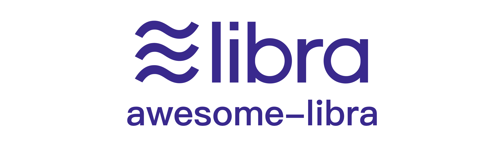

# Awesome Libra <!-- omit in toc --> 
A Curated List of Awesome Libra Resources

# Contents <!-- omit in toc --> 
- [Official Resources](#official-resources)
- [Tools](#tools)
  - [Wallets](#wallets)
  - [Block Explorer](#block-explorer)
- [SDK](#sdk)
  - [JavaScript](#javascript)
  - [Python](#python)
  - [Go](#go)
  - [Java](#java)
- [Develop](#develop)
  - [IDE](#ide)
  - [Courses](#courses)
  - [Move](#move)
  - [Others](#others)
- [EcoProjects](#ecoprojects)
- [Community](#community)
- [Others](#others-1)
  - [Article](#article)
  - [Video](#video)

# Official Resources
* [Website](https://libra.org) - Official Libra website
*  [Official Docs](https://developers.libra.org/docs/welcome-to-libra) - Welcome to the Libra developer site.
* [White Paper](https://libra.org/en-US/white-paper/) - Official description of the Libra
* [Introducing Libra (YouTube)](https://www.youtube.com/watch?time_continue=1&v=4zw-jpVFKMY) - Promo video about Libra by Libra Association
* [libra on Twitter](https://twitter.com/search/libra) - Official twitter account
* [Libra on GitHub](https://github.com/libra/libra) - Official repository

# Tools
## Wallets
* [Libra Wallet Poc](https://dev.kulap.io/libra/) - POC Libra wallet.
* [Libra Wallet](https://github.com/dpikalov/libra-wallet) - Wallet frontend, don't have backend.
* [LibraTerminal](https://github.com/sns254/LibraTerminal) – POC command line wallet.
  
## Block Explorer
* [ilibraExplorer](https://ilibraexplorer.com/) - Blockchain Explorer for Libra.
* [librabrowser](https://librabrowser.io/?fbclid=IwAR1LjpGiLWwW3oIFHnM3dm6H47H6D2R0dRAsqjmCcJSNtpW7yCcJu1ud2hE) - Libra Testnet Explorer and its [source code](https://github.com/Disk1n/LibraBrowser).
* [libratics](http://libratics.com) - Libratics is a Libra Analytics (Testnet).
* [libravista](http://libravista.com)
* [LibraBlock](https://librablock.io) - First opensource Libra explorer
  * [librablock-frontend](https://github.com/libra-china-org/librablock-frontend) - Open source frontend
  * [librablock-backend](https://github.com/libra-china-org/librabock-backend) - Open source backend
* [Libranaut](https://libranaut.io/) - Possibly the first for Libra.
* [Jibra](http://explorer.jibra.org) - Libra Testnet Explorer, made in Japan. 
  
# SDK
## JavaScript
* [libra-core](https://github.com/perfectmak/libra-core) - A javascript client for libra network.
* [libra-api](https://github.com/bonustrack/libra-api) - A REST API for Libra blockchain.
* [libra-grpc](https://github.com/bonustrack/libra-grpc) - A lightweight JavaScript library for Libra.
* [libra-web](https://github.com/bandprotocol/libra-web) - Unofficial Javascript Client for Libra Blockchain.
## Python
* [libra-grpc-py](https://github.com/egorsmkv/libra-grpc-py) - gRPC client for Libra in Python.
* [PyLibra](https://github.com/bandprotocol/pylibra) - Python SDK client for Libra with full client-side functionality.
  
## Go
* [go-libra](https://github.com/the729/go-libra) - Libra go client library with crypto verifications.
* [Libra Golang Client](https://github.com/codemaveric/libra-go) - Go Client for interacting with Libra Blockchain.
* [Libra SDK for Go](https://github.com/philippgille/libra-sdk-go) - Go SDK for Libra.
* [libra_example](https://github.com/phlip9/libra_example) - Example Libra Go client SDK.
## Java
* [libraj](https://github.com/libra-vista/libraj) - A Java client for libra.
* [jlibra](https://github.com/ketola/jlibra) - A Java library for interacting with the Libra blockchain.
* [jlibra-spring-boot-starter](https://github.com/ice09/jlibra-spring-boot-starter) - Spring Boot Starter project based on jlibra.
* [java-libra-client](https://github.com/ice09/java-libra-client) - Java Shell for Libra based on jlibra-spring-boot-starter and jlibra. 

# Develop
## IDE
* [LibraIDE](https://libraide.com/) - Libra Move contract editor.
* [VSCode Plugin](https://marketplace.visualstudio.com/items?itemName=SDKBox.vscode-libra-move) - Libra Move language (syntax highlighting, snippets) for Visual Studio Code.
  * [VSCode Plugin Github](https://github.com/sdkbox/vscode-libra-move) - VSCode Plugin Source
## Courses
* [LibraIDE](https://learnlibramove.com/) - Learning Libra Move within 7 Days?Let's try MoveCastle
* [CryptoZombies](https://cryptozombies.io/libra/) - (Libra/Move Edition) Upcoming! - learn Libra blockchain contract programming by coding your own game using the Move programming language; 
* [Libra区块链钱包开发实录附源码 - LearnDapp系列](https://github.com/learndapp/LearnDapp/blob/master/topics/libra/01/libra-wallet.md)
## Move
* [Move Language](https://developers.libra.org/docs/assets/papers/libra-move-a-language-with-programmable-resources.pdf)
## Others
* [libra-utils](https://github.com/Berkays/libra-util) - Interface to Libra CLI commands to simplify parsing.  
  
# EcoProjects
* [pLIBRA](https://plibra.io) - A privacy-preserving Libra Coin on Polkadot ecosystem.

# Community
* [Official Community](https://community.libra.org/)
* [Telegram: Libra Devs](https://t.me/joinchat/DAQb4RSNpqEok3p-QdmaKQ)
* [LibraChina](https://libra-china.org) - Libra中国社区
  * [Community](https://community.libra-china.org) - 中文论坛

# Others
## Article
* [First Look: Libra](https://info.binance.com/en/research/marketresearch/libra.html) - An in-depth review of Facebook's long-anticipated entry into cryptocurrency, written by binance.
## Video
* [The Libra Blockchain (Paper Review)](https://youtu.be/dcAqb0wBl5g) - Talk about the design by reviewing the technical whitepaper.
* [Facebook发布Libra，颠覆金融业，干掉比特币?](https://www.youtube.com/watch?v=qG3oBuZoOxM)
* [Google Coin vs Facebook Libra](https://www.youtube.com/watch?v=uJzUkCKYPDw) 

## Awesome Awesomeness<!-- omit in toc --> 

- [Awesome Libra Blockchain](https://github.com/copperbits/awesome-libra) by Copperbits 
- [Awesome Libra](https://github.com/learndapp/awesome-libra) by LearnDapp 
- [Awesome Libra](https://github.com/methuz/Awesome-Libra) by Methuz Kaewsaikao 
- [#awesome-libra](https://github.com/topics/awesome-libra) Topic @ GitHub

## Contribute<!-- omit in toc --> 

Pull requests are welcome! In the spirit of decentralized applications however.
You can also contract me, I will add some item for you.
* My Email: fishwarter#gmail.com
* My Wechat: noding

## License<!-- omit in toc --> 

The list is dedicated to the public domain. Use it as you please with no restrictions whatsoever.